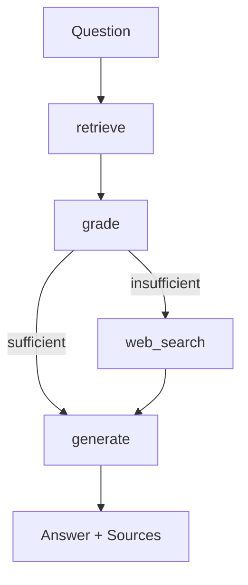

# Lecture Slide Corrective RAG Agent

An agentic Retrieval-Augmented Generation system that answers questions from lecture slides, autonomously falling back to web search when the slide content is insufficient — with full source attribution, automated evaluation, and observability.

## Overview

This project ingests lecture slide PDFs, builds a semantic search index over them, and answers natural-language questions by retrieving the most relevant slides. Unlike a standard RAG pipeline, the system uses an **LLM-based sufficiency check** to decide, per question, whether the retrieved slides are enough to answer accurately — and if not, it autonomously searches the web for supplementary context before generating a final, source-attributed answer.

This is a **routing-pattern agentic workflow** : the LLM makes one bounded decision — *is this context sufficient?* — rather than open-ended multi-step planning. It was built deliberately at this scope to keep the decision boundary auditable and evaluable.

## Key Features

- **PDF ingestion pipeline** — slide-level text extraction (PyMuPDF), metadata-rich chunking, and embedding generation
- **Semantic retrieval** — Qdrant vector database with locally-served `bge-m3` embeddings (Ollama), deterministic UUID5 point IDs enabling safe multi-document re-ingestion
- **Corrective RAG agent** (LangGraph) — retrieve → grade context sufficiency → conditionally web-search → generate, with full source attribution (slide number + source document, or web)
- **Automated evaluation** — routing accuracy and answer faithfulness measured via LLM-as-judge, tracked as LangSmith experiments against a hand-labeled question set
- **Observability** — full LangSmith tracing of every agent run (node-level latency, decisions, inputs/outputs)
- **REST API** (FastAPI) — API-key-authenticated `/ask` endpoint and a `/upload` endpoint that triggers ingestion for new PDFs on the fly
- **Containerized** — Dockerfile with layer-cached builds; runs against host-machine Ollama and Qdrant via `host.docker.internal`
- **Tested** — pytest coverage for deterministic components (chunking, context building) and API auth behavior

## Architecture



- **retrieve** — embeds the question, queries Qdrant for the top-k most similar slides
- **grade** — a dedicated LLM call judges whether the retrieved slides can fully answer the question (EVET/HAYIR), independent of answer generation
- **web_search** — only invoked when grading fails; pulls supplementary context via DuckDuckGo search
- **generate** — synthesizes a final answer from slides (and web results, if used), explicitly citing which source each claim came from

## Tech Stack

| Layer | Technology |
|---|---|
| Agent orchestration | LangGraph |
| LLM (local) | Ollama (`qwen3:8b`) |
| Embeddings | Ollama (`bge-m3`, 1024-dim) |
| Vector database | Qdrant |
| PDF extraction | PyMuPDF |
| API | FastAPI + Uvicorn |
| Evaluation & Observability | LangSmith, custom LLM-as-judge |
| Testing | pytest |
| Containerization | Docker |
| Web search (fallback) | DuckDuckGo (`ddgs`) |

## Project Structure

myAgent/
├── data/
│ ├── raw/ # source PDFs
│ ├── processed/ # extracted/chunked intermediate JSON
│ └── eval/ # hand-labeled evaluation question set
├── src/
│ ├── ingestion/ # PDF → text → chunks → embeddings → Qdrant
│ ├── retrieval/ # semantic search over Qdrant
│ ├── agent/ # LangGraph state, nodes, and graph definition
│ ├── evaluation/ # LLM-as-judge, LangSmith dataset + experiment runner
│ └── api/ # FastAPI app
├── tests/ # pytest suite
├── Dockerfile
└── requirements.txt


## Getting Started

### Prerequisites
- Python 3.11
- [Ollama](https://ollama.com) with `qwen3:8b` and `bge-m3` pulled
- Docker (for Qdrant)

### Setup

```bash
# 1. Clone and create environment
git clone https://github.com/sudenazoztrk/MyAgent.git
cd MyAgent
conda create -n slayt-agent python=3.11 -y
conda activate slayt-agent
pip install -r requirements.txt

# 2. Start Qdrant
docker run -d --name qdrant-slayt -p 6333:6333 -p 6334:6334 \
  -v $(pwd)/qdrant_storage:/qdrant/storage qdrant/qdrant

# 3. Configure secrets
cp .env.example .env   # fill in LANGSMITH_API_KEY, MY_API_KEY

# 4. Ingest a PDF
# Place a PDF in data/raw/, then:
python3 -m src.ingestion.extract

# 5. Run the API
python3 -m uvicorn src.api.main:app --reload
```

Interactive API docs available at `http://localhost:8000/docs`.

### Running with Docker

```bash
docker build -t slide-agent-api .
docker run -d --name slide-agent-container -p 8000:8000 \
  --env-file .env \
  -e OLLAMA_HOST=http://host.docker.internal:11434 \
  -e QDRANT_HOST=host.docker.internal \
  slide-agent-api
```

### Example request

```bash
curl -X POST http://localhost:8000/ask \
  -H "X-API-Key: <your-key>" \
  -H "Content-Type: application/json" \
  -d '{"question": "What is lazy learning?"}'
```

## Evaluation

The agent is evaluated on a hand-labeled question set (`data/eval/questions.json`) across two metrics, tracked as LangSmith experiments:

- **Routing accuracy** — did the `grade` node correctly decide whether slide context was sufficient?
- **Faithfulness** — does the generated answer avoid introducing claims not present in the retrieved context (slides and/or web)? Measured via a dedicated LLM-as-judge call, separate from the generation prompt.

On the initial evaluation set: **100% routing accuracy**, **faithfulness ~80–100%** depending on the run (one flagged case involved over-synthesis across multiple sources — see *Known Limitations*).

## Known Limitations & Future Work

- The `grade` node's decision is currently binary with no exposed rationale in the API response (a `grade_reason` field was prototyped but not yet wired through).
- No rate limiting on the API (evaluated `slowapi`, deferred as out of scope for a single-user demo).
- Streaming responses were considered but deferred — the agent's multi-step structure only allows the final `generate` step to stream, which added architectural complexity disproportionate to the benefit at this scale.
- Cloud deployment was evaluated conceptually (managed compute, container registries, secrets management, CI/CD) but not deployed live, due to the cost of running local LLM inference at cloud scale; see write-up in project notes.

## License

MIT